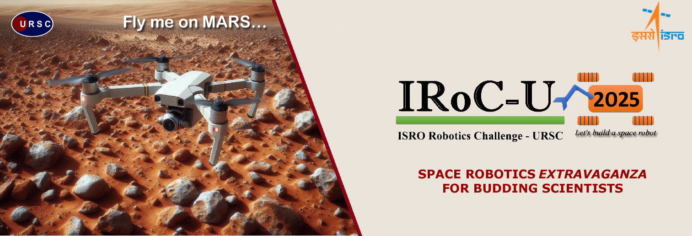

# 🚀 ISRO IRoC 2025 – Rover Challenge  
**Team MARVEN | ID: 10729**

A terrain-adaptive **Autonomous Mars Rover Prototype** developed for the **ISRO IRoC 2025 Challenge**. Designed for simulated Martian exploration, the rover features robust mobility, object interaction, and mission-ready autonomy.

---

## 🌍 Social Impact

Supports key global goals:
- **SDG 9:** Innovation & Infrastructure  
- **SDG 13:** Climate Action  
- **SDG 4:** Quality Education  

> 🛰️ Fostering student-led space-tech innovation and research in planetary robotics.

---

## 🏆 Achievements

- ✅ **Cleared Prelims – ISRO Robotics Challenge 2025**  
  Selected based on innovative design and mission readiness.

---
